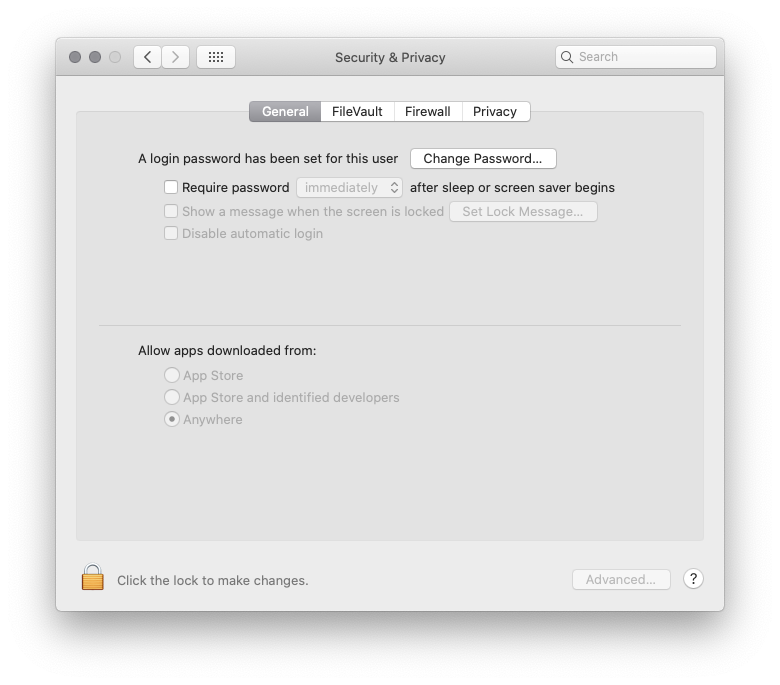
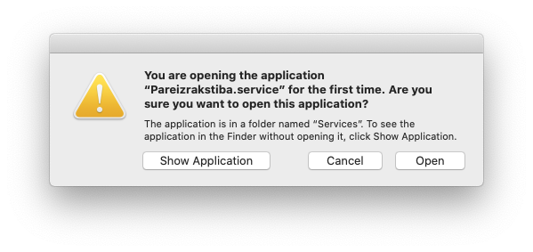
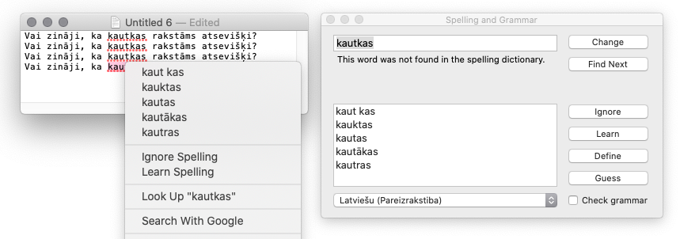

# Pareizrakstība

Pareizrakstība - Latvian spellcheck for macOS operating system.  
Service that adds support for system wide spellchecking in Latvian language.

## Requirements

* Built for macOS 10.13+ (it could be built for older deployment targets).  
* Tested on 10.15.5. and 10.13.6
* 64-bit only.
* For yet older OS versions, see [Pareizrakstiba-Archive](https://github.com/WARP-LAB/Pareizrakstiba-Archive).

## Installation

This application is not signed as the developer is not willing to pay the Apple fee[1].  

If you wish to use this then before running *Installer* you have enable the possibility of running unsigned apps on macOS.

* Open *Terminal.app*.

* Search for it by name in *Spotlight* or find it under `/Applications/Utilities`.

* Copy and paste this one-liner command and hit *Enter*

	```sh
	sudo spctl --master-disable
	```
* You will be asked for administrator password, enter it.

* Visit *System Preferences : Security & Privacy : General* 

* Check that *Anywhere* is selected for *Allow apps downloaded from*



* If not, then unlock *System Preferences* and set it to *Anywhere*

* Run *Installer.app*. You might have to use right-click and *Open* instead of double click. It can be used both for installing and uninstalling Pareizrakstība.

* On first use in any app using spellchecking you might be greeted with a dialog which will ask if you want to open Pareizrakstība as it is run for the first time. Clicking *Open* is suggested.



* Aiziet!



## Notes

* Make sure that in applications Latvian spellcheck is selected *Edit : Spelling and Grammar : Show Spelling and Grammar : Latviešu (Pareizrakstiba)*
* Play around with settings under *System Preferences : Keyboard : Text*. Here you can also set preferred default spelling language (*Installer* also has a step which lets you choose Latvian as preferred).
* *LibreOffice* / *OpenOffice* et al. users have no need to download and install dictionaries from within these apps, for the mentioned applications use macOS system wide spellcheck. Besides, when using Pareizrakstība in the applications and adding new words, they will apply to the whole OS.
* Learned words are kept in `~/Library/Spelling/`
* Since Mac OS X 10.6 shortcut for the rarely used autocompletion list is either `Option+Esc` or `F5`, previously it was `Esc`.

[1] This project has been continued over a decade now. Although it was used widely in the community *donations never worked*. If you wish for it to be officially signed, for example you wish to run this in a strict corporate environment or plainly do not want to open up your system for unsigned apps, build it from source on every machine or contact the developer for options (you / community could sponsor the Apple fee so that signed version can be built).


```
Pareizrakstība - Latviešu valodas pareizrakstības pārbaude macOS operētājsistēmai
Pareizrakstiba - Latvian spellcheck for macOS operating system
Copyright (C) 2008-2020 Reinis Adovičs a.k.a. kroko

GNU GENERAL PUBLIC LICENSE
Version 2, June 1991
https://www.gnu.org/licenses/old-licenses/gpl-2.0.en.html
```
